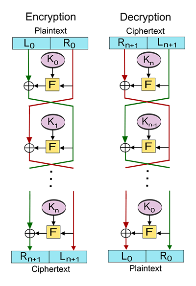

# feistel-jar


This is a Scala library and JVM executable implementing the Feistel cipher for Format-Preserving Encryption (FPE).

### Motivation

The main objective of this library is not to provide a secure encryption scheme but rather a safe obfuscation tool with format-preserving.


### Formal description

This library operates on the concept of the Feistel cipher described in [Wikipedia](https://en.wikipedia.org/wiki/Feistel_cipher) as:
> A Feistel network is subdivided into several rounds or steps. In its balanced version, the network processes the data in two parts of identical size. On each round, the two blocks are exchanged, then one of the blocks is combined with a transformed version of the other block.
> Half of the data is encoded with the key, then the result of this operation is added using an XOR operation to the other half of the data.
> Then in the next round, we reverse: it is the turn of the last half to be encrypted and then to be xored to the first half, except that we use the data previously encrypted.
> The diagram below shows the data flow (the ${\oplus}$ represents the XOR operation). Each round uses an intermediate key, usually taken from the main key via a generation called key schedule. The operations performed during encryption with these intermediate keys are specific to each algorithm.



The algorithmic description (provided by Wikipedia) of the encryption is as follows:
* Let $n+1$ be the number of steps, $K_{0},K_{1},...,K_{n}$ the keys associated with each step and $F:\Omega\times\mathcal{K}\mapsto\Omega$ a function of the $(words{\times}keys)$ space to the $words$ space.
* For each step $i{\in}[0;n]$, note the encrypted word in step $i,m_{i}=L_{i}||R_{i}$:
  * $L_{i+1}=R_{i}$
  * $R_{i+1}=L_{i}{\oplus}F(L_{i},K_{i})$
* $m_{0}=L_{0}||R_{0}$ is the unciphered text, $m_{n+1}=L_{n+1}||R_{n+1}$ is the ciphered word. 

There is no restriction on the $F$ function other than the XOR operation must be possible. For simplicity, we will choose $L_1$ of the same size as $R_1$ and the function $F$ shall transform a word of length $k$ into a word of length $k$ (and this for all $k$).


### Usage

#### Executable

You may use the JAR as a stand alone application on the command line:
```
feistel-jar 1.5.7
Usage: java -cp feistel-jar_2.12-1.5.7.jar com.cyrildever.feistel.Main [options] <input>

  -d, --decrypt            add to deobfuscate the passed input
  -h, --hashEngine <value>
                           the hash engine for the round function (default SHA-256)
  -r, --rounds <value>     the number of rounds for the Feistel cipher (default 10)
  -k, --key <value>        the optional key for the FPE scheme (leave it empty to use default)
  -o, --output <value>     the optional name of the output file
  <input>                  the data to process
```
eg.
```console
$ java -cp path/to/feistel-jar_2.12-1.5.7.jar com.cyrildever.feistel.Main 'myWordToObfuscate'
```

#### Library

In a Scala 2.12 project:
```sbt
libraryDependencies += "com.cyrildever" %% "feistel-jar" % "1.5.7"
```

To get an obfuscated string from a source data using an automatic key generation from SHA-256 hashing function at each round, first instantiate a `Feistel.FPECipher`, passing it a hash engine, a base key and a number of rounds.
Then, use the `encrypt()` method with the source data as argument. The result will be a readable custom Base-256 string.
To ensure maximum security, I recommend you use a 256-bit key or longer and a minimum of 10 rounds.
You may use either of the following hash engine:
- `Blake2b-256`;
- `Keccak-256`;
- `SHA-256`;
- `SHA3-256`.

The decryption process uses the obfuscated string and pass it to the `decrypt()` method of the `Feistel.FPECipher`.

```scala
import com.cyrildever.feistel.Feistel
import com.cyrildever.feistel.common.utils.hash.Engine._

val source = "my-source-data"

// Encrypt
val cipher = Feistel.FPECipher(SHA_256, "some-32-byte-long-key-to-be-safe", 10)
val obfuscated = cipher.encrypt(source)

// Decrypt
val deciphered = cipher.decrypt(obfuscated)

assert(deciphered == source)

// For preserving numbers
val sourceNumber = 123456789
val obfuscatedNumber = cipher.encryptNumber(sourceNumber)
val decipheredNumber = cipher.decryptNumber(obfuscatedNumber)
assert(decipheredNumber == sourceNumber)
```

_NB: You'd also need provide the expected [BouncyCastle JAR file](./bcprov-jdk15to18-1.80.jar)._


### Other implementations

For those interested, I also made two other implementations of this cipher in [Typescript](https://github.com/cyrildever/feistel-cipher), in [Go](https://github.com/cyrildever/feistel) and in [Python](https://github.com/cyrildever/feistel-py).

I also created a special library for redacting classified documents using this FPE cipher. Feel free to [contact me](mailto:cdever@pep-s.com) about it.


### White papers

I wrote two white papers to make it a fully FPE scheme that you can find in the above-mentioned repositories.


### License

This module is distributed under a MIT license. \
See the [LICENSE](LICENSE) file.


<hr />
&copy; 2021-2025 Cyril Dever. All rights reserved.